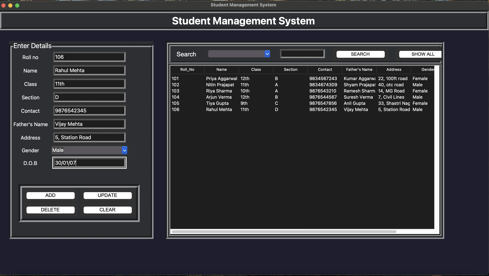

# Student Management System

A desktop application built with Python, Tkinter and MySQL.

## Screenshot

## Features
- Add, Update, Delete student records
- Search by Name, Roll No, Contact, D.O.B
- Dark theme UI

## Technologies Used
- Python
- Tkinter
- MySQL (pymysql)

## How to Run
1. Install dependencies: `pip install pymysql`
2. Setup MySQL database
3. Run: `python main.py`
